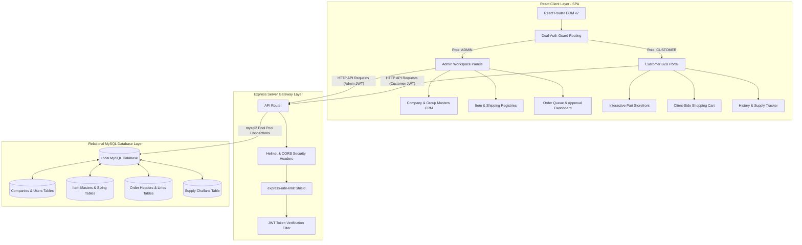
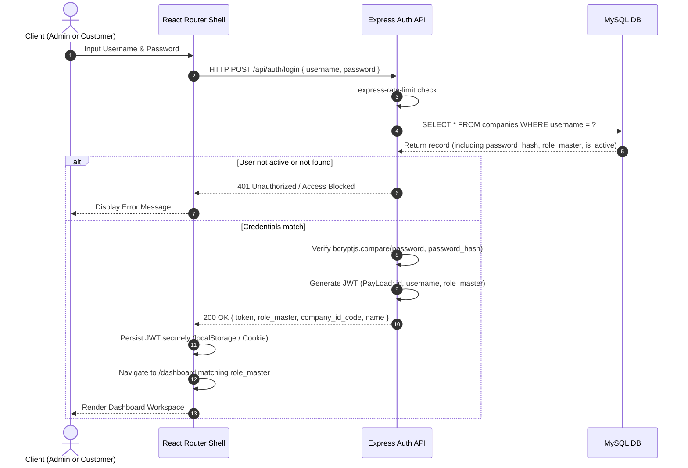
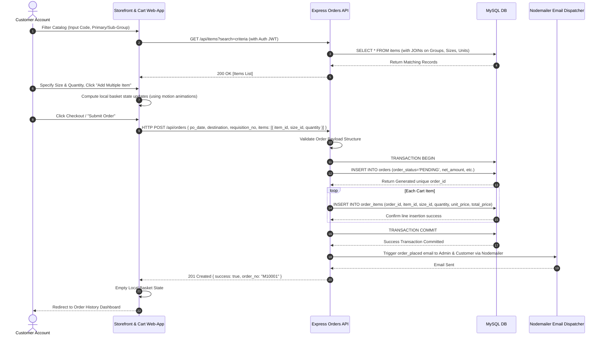

# MACO ERP Portal: Project Flow Diagrams & Architectural Interaction

## Unified B2B Order Lifecycle, User Authentication, and Stock Management

This document maps out the system-level architectures, sequence interactions, and transactional state transitions of the **MACO Online ERP System**. It serves as an engineering blueprint to help developers implement correct state syncing, secure API routes, and clean user interactions using the full-stack **React + Express + MySQL** architecture.

---

## 1. System-Level Architecture Block Diagram

The diagram below indicates how the modular Client Application, secure Express API Gateway, and local MySQL Database tables connect:



---

## 2. Dynamic Transactional Sequences

The following sequences describe the logical data flow across the client, server, and local database during key daily business activities.

### Flow A: Multi-Tenant Secure Authentication Setup

Before loading any dashboards, user verification is routed via robust security checks matching salted bcrypt hashes:



---

### Flow B: B2B Part Selection & Checkout Sequence

This sequence models the customer-facing e-Commerce flow, from searching the custom part registry to completing checkout:



---

### Flow C: Administrative Approval & Supply Dispatch Track Setup

This workflow captures how MACO administrators evaluate pending client requests and fulfill deliveries through shipping partners:

```mermaid
sequenceDiagram
    autonumber
    actor Admin as MACO Admin
    participant Dashboard as Admin Dashboard Queue
    participant Srv as Express Admin API
    participant DB as MySQL DB
    participant PDF as jsPDF Engine
    participant Mail as Nodemailer Email Dispatcher

    Admin->>Dashboard: Open Manage Orders and select a Pending order
    Dashboard->>Srv: GET /api/orders/pending
    Srv->>DB: SELECT * FROM orders WHERE order_status = 'PENDING'
    DB-->>Srv: Return order collection
    Srv-->>Dashboard: 200 OK [Orders Array]

    alt Option 1: Reject Request
        Admin->>Dashboard: Click "Reject Order"
        Dashboard->>Srv: HTTP PATCH /api/orders/:id/status { status: 'REJECTED' }
        Srv->>DB: UPDATE orders SET order_status = 'REJECTED', review_date = NOW()
        DB-->>Srv: Complete update
        Srv-->>Dashboard: 200 OK Success Message
        Dashboard-->>Admin: Refresh view; card marks Rejected
    else Option 2: Approve Request & Ship
        Admin->>Dashboard: Click "Approve Order"
        Dashboard->>Srv: HTTP PATCH /api/orders/:id/status { status: 'ACCEPTED' }
        Srv->>DB: UPDATE orders SET order_status = 'ACCEPTED', review_date = NOW()
        DB-->>Srv: Complete update
        Srv-->>Dashboard: 200 OK (Status Update Complete)

        Admin->>Dashboard: Select Order & Click "Upload Challan Details"
        Admin->>Dashboard: Fill Challan Form (Select Carrier, Input Challan No, Date)
        Dashboard->>Srv: HTTP POST /api/challans { order_id, carrier_id, challan_no, challan_date, details }
        Srv->>DB: INSERT INTO supply_challans (challan_no, order_id, carrier_id, challan_date, supply_details)
        DB-->>Srv: Confirm Logistics Insertion

        Srv->>Mail: Trigger "Order Dispatched / Challan Created" Email notification
        Mail-->>Srv: Email Sent
        Srv-->>Dashboard: 201 Created Success Response

        Dashboard->>PDF: Initiate jsPDF & AutoTable compiling (Client-side)
        PDF->>PDF: Generate Grid layout mapping items list, amounts, and carrier codes
        PDF-->>Admin: Download "M10001_INVOICE_CHALLAN.pdf"
    end
```

---

## 3. Order Master State Machine

An order moves through strict sequential states. It is protected against out-of-order mutations (e.g., an order cannot have a shipping challan generated until its status is set to `ACCEPTED`):

```mermaid
stateDiagram-v2
    [*] --> PENDING : Customer checkout completes / Order created in system

    state PENDING {
        note right of PENDING: Visible on Admin & Customer dashboards as "Pending"
    }

    PENDING --> REJECTED : Admin declines order via review
    PENDING --> ACCEPTED : Admin accepts order via review

    state REJECTED {
        note left of REJECTED: Final terminal state. Order is canceled.
    }

    state ACCEPTED {
        note right of ACCEPTED: Visible as Accepted. Ready for logistics fulfillment.
    }

    ACCEPTED --> DISPATCHED : Admin uploads carrier association & supply challan details

    state DISPATCHED {
        note right of DISPATCHED: Invoice PDF unlocked. Supply tracker reveals carrier details.
    }

    REJECTED --> [*]
    DISPATCHED --> [*]
```

---

## 4. API Endpoint Interaction Mapping

This list connects crucial frontend views to respective Node.js Express REST and MySQL transactional queries:

| Interface Section            | Intent / Trigger            | REST Endpoint                   | Database Operation / Query                                                                       |
| :--------------------------- | :-------------------------- | :------------------------------ | :----------------------------------------------------------------------------------------------- |
| **Login Matrix Portal**      | User Login                  | `POST /api/auth/login`          | Check table credentials using `sqlite2` or `mysql2` matching input credentials.                  |
| **Manage Company CRM**       | Add / Edit Company Account  | `POST/PUT /api/companies`       | `INSERT INTO` or `UPDATE companies SET ...` mapping all taxes, credentials, and roles.           |
| **Primary Groups panel**     | Group Registration          | `POST /api/primary-groups`      | `INSERT INTO primary_groups (group_name, description) VALUES (?, ?)`                             |
| **Subgoup Masters panel**    | Subgroup Allocation         | `POST /api/sub-groups`          | `INSERT INTO sub_groups (sub_group_name, primary_group_id, chapter_heading_no) VALUES (?, ?, ?)` |
| **Item Masters panel**       | Catalog Registry CRUD       | `POST/PUT /api/items`           | Write stock profile details to `items` catalog database.                                         |
| **Customer Part Storefront** | View stocks catalog         | `GET /api/items`                | `SELECT * FROM items JOIN primary_groups JOIN item_sizes...`                                     |
| **Cart Checkout Trigger**    | Submit customer cart        | `POST /api/orders`              | Create transaction, inserting order headers into `orders` and bulk lines into `order_items`.     |
| **Admin dashboard overview** | Load visual statuses counts | `GET /api/dashboard/stats`      | `SELECT order_status, COUNT(*) FROM orders GROUP BY order_status`                                |
| **Admin verification Desk**  | Accept/Reject commands      | `PATCH /api/orders/:id/status`  | `UPDATE orders SET order_status = ? WHERE id = ?`                                                |
| **Logistics manager panel**  | Upload Supply details       | `POST /api/challans`            | `INSERT INTO supply_challans` linking orders, dates, and shipping carriers.                      |
| **Customer supply tracking** | Track deliveries            | `GET /api/challans/company/:id` | `SELECT * FROM supply_challans JOIN shipping_carriers WHERE company_id = ?`                      |

---

_This operational mapping guidelines file establishes the system design standard for implementing the MACO ERP System._
